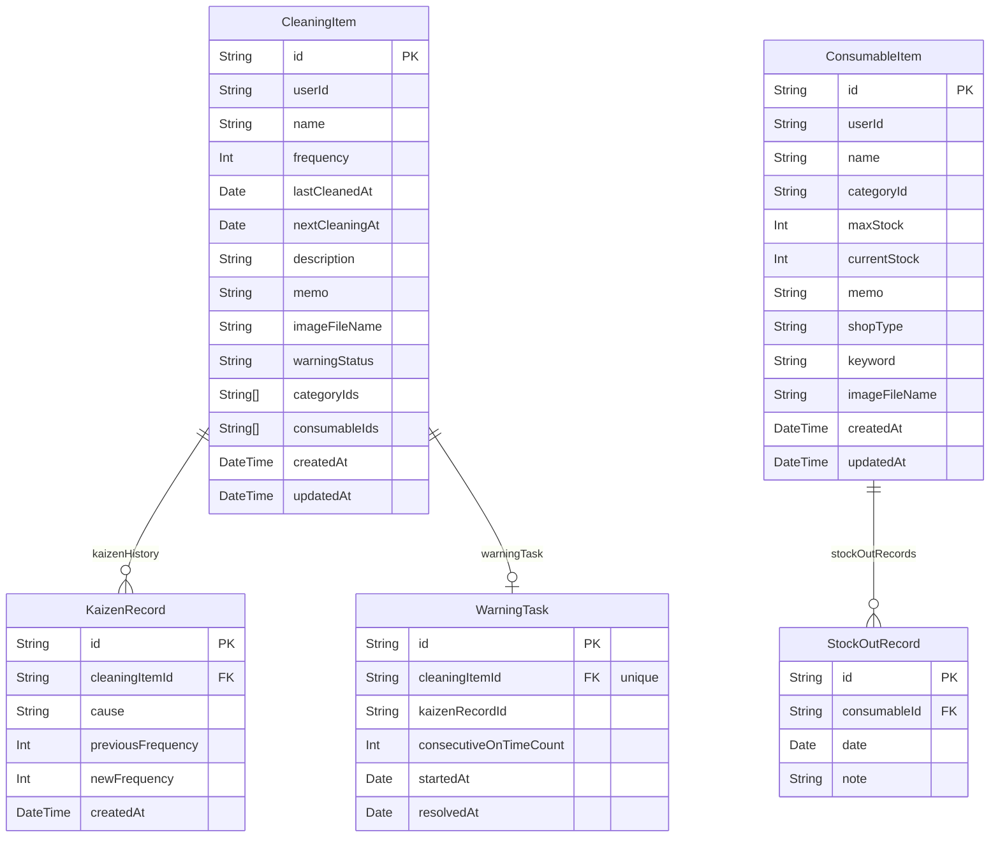

# CleanTask

家庭の掃除タスクと消耗品在庫をまとめて管理する Web アプリです。

## 機能概要

### 掃除タスク管理
- タスクの登録・編集・削除
- 掃除頻度（日数）を設定し、次回日付を自動計算
- 期限超過・本日・まもなくのステータスバッジ表示
- カテゴリーによるタグ付け・絞り込み

### 警戒タスク（改善サイクル）
- タスクを期限内に連続 3 回完了すると「警戒」状態が解除される仕組み
- 改善の原因・新しい頻度を記録する改善（カイゼン）フォーム
- スタンプ式の連続達成カウンター表示

### 消耗品管理
- 消耗品の在庫数・最大在庫数を管理
- 掃除タスクと消耗品を紐付け、完了時に自動で在庫を減算
- 在庫切れ時は購入先（実店舗 / ネットショップ）へ誘導
- レシート画像を取り込む OCR 機能（拡張対応）

### その他
- ヘッダーのベルアイコンで「期限超過タスク件数 ＋ 在庫切れ消耗品件数」をリアルタイム表示
- マルチアカウント対応（ユーザーごとにデータを分離）
- アカウント設定（ユーザー名・メール変更）

---

## データベース構成（ER図）



---

## インフラ構成

```
┌─────────────────────────────────────────────────────────────────────┐
│                          インターネット                               │
└──────────────────────────────┬──────────────────────────────────────┘
                               │ HTTPS
                               ▼
┌─────────────────────────────────────────────────────────────────────┐
│                            Vercel                                    │
│                                                                     │
│  ┌──────────────────────────────────────────────────────────────┐  │
│  │                     Next.js 16 App                           │  │
│  │                                                              │  │
│  │  ┌─────────────────┐   ┌────────────────────────────────┐   │  │
│  │  │ Edge Middleware │   │     Server Components          │   │  │
│  │  │  (proxy.ts)     │   │  (layout.tsx, page.tsx 等)     │   │  │
│  │  │                 │   │  ・DB クエリ（Prisma）          │   │  │
│  │  │ セッション検証   │   │  ・初期データフェッチ           │   │  │
│  │  │ 未認証→/login   │   └────────────┬───────────────────┘   │  │
│  │  └────────┬────────┘                │                        │  │
│  │           │                         ▼                        │  │
│  │           │          ┌────────────────────────────────┐      │  │
│  │           │          │     Server Actions             │      │  │
│  │           │          │  (actions.ts)                  │      │  │
│  │           │          │  ・CRUD 操作                    │      │  │
│  │           │          │  ・revalidatePath              │      │  │
│  │           │          └────────────┬───────────────────┘      │  │
│  │           │                       │                          │  │
│  │           │          ┌────────────▼───────────────────┐      │  │
│  │           │          │     Client Components          │      │  │
│  │           │          │  (CleaningContext 等)           │      │  │
│  │           │          │  ・楽観的更新                   │      │  │
│  │           │          │  ・フィルタ / ソート            │      │  │
│  │           │          └────────────────────────────────┘      │  │
│  └──────────────────────────────────────────────────────────────┘  │
│                                                                     │
│  GitHub main ブランチ push → 自動デプロイ                            │
└────────────┬──────────────────────────────┬────────────────────────┘
             │                              │
             │ PostgreSQL                   │ Auth API
             ▼                              ▼
┌────────────────────────────────────────────────────────────────────┐
│                           Supabase                                  │
│                                                                     │
│  ┌──────────────────────────────┐  ┌──────────────────────────┐   │
│  │        PostgreSQL DB          │  │      Supabase Auth       │   │
│  │                              │  │                          │   │
│  │  CleaningItem                │  │  ・メール/パスワード認証  │   │
│  │  KaizenRecord                │  │  ・JWT セッション管理     │   │
│  │  WarningTask                 │  │  ・user.id でテナント分離 │   │
│  │  ConsumableItem              │  └──────────────────────────┘   │
│  │  StockOutRecord              │                                  │
│  │                              │  ┌──────────────────────────┐   │
│  │  接続: pgBouncer             │  │    Supabase Storage      │   │
│  │  (port 6543, pooling)        │  │                          │   │
│  │  ※マイグレーション時のみ      │  │  bucket: "cleaning"      │   │
│  │    DIRECT_URL (port 5432)    │  │  掃除タスク画像保存       │   │
│  └──────────────────────────────┘  └──────────────────────────┘   │
└────────────────────────────────────────────────────────────────────┘
```

| サービス | 役割 |
|----------|------|
| **Vercel** | Next.js ホスティング・CDN・自動デプロイ（GitHub 連携） |
| **Supabase PostgreSQL** | アプリデータ永続化（Prisma 経由） |
| **Supabase Auth** | 認証・セッション管理（`@supabase/ssr`） |
| **Supabase Storage** | 掃除タスクの画像ファイル保存 |
| **GitHub** | ソースコード管理・CI トリガー |

---

## 技術スタック

| 区分 | 技術 |
|------|------|
| フレームワーク | Next.js 16（App Router / Turbopack） |
| UI | React 19 / Tailwind CSS v4 |
| 言語 | TypeScript |
| ORM | Prisma v7（`prisma-client-js` + `@prisma/adapter-pg`） |
| DB | Supabase（PostgreSQL） |
| 認証 | Supabase Auth（`@supabase/ssr`） |
| Lint / Format | Biome |
| デプロイ | Vercel |

---

## 工夫した点

### 1. Server Actions × 楽観的更新の組み合わせ

掃除タスクの完了・編集・削除は Next.js の **Server Actions** でサーバー側を更新しつつ、`CleaningContext` の `useState` で **楽観的更新（optimistic update）** を行っています。ボタンを押した瞬間に UI が即応し、バックグラウンドで DB へ反映されるため、操作レスポンスが速く感じられます。

```
ボタン押下
  ├─ setItems(新しいstate) → UI が即座に更新
  └─ await completeCleaningTask(id) → DB へ書き込み + revalidatePath
```

### 2. 警戒タスクの日付計算ロジック

「期限内に完了したか／期限超過で完了したか」によって、次回日付の算出基点を切り替えています。

- **期限内完了**: `現在の nextCleaningAt + 頻度日数`（毎回押すたびに日付が前進）
- **期限超過完了**: `今日 + 頻度日数`（今日からリセット）

単純に「今日 + 頻度」とすると同じ日に何度押しても日付が変わらず、進捗が見えにくくなります。この計算を Server Action と楽観的更新の両方に適用することで、UI と DB が常に一致した状態を保っています。

### 3. マルチテナントのデータ分離

`CleaningItem` / `ConsumableItem` モデルに `userId` フィールドを追加し、全クエリ・全 Server Action でフィルタリングしています。また、機能追加前に作成された既存データ（`userId = ""`）を操作した際に自動で現在のユーザーへ帰属させる後方互換処理も実装しています。

```typescript
// 新旧どちらのデータも操作できつつ、旧データを現ユーザーへ自動移行
where: { id, OR: [{ userId }, { userId: "" }] }
```

### 4. Prisma v7 × Supabase のアダプター構成

Prisma v7 では `PrismaClient` のコンストラクタにアダプターを渡す必要があります。`pg.Pool` + `PrismaPg` アダプターを組み合わせることで、Supabase の接続プーラー（pgBouncer）経由でも動作するよう設定しています。また、`next.config.ts` の `serverExternalPackages` に Prisma 関連パッケージを指定することで、Turbopack との競合（`this` 参照エラー）を回避しています。

### 5. Server Component と Client Component の役割分担

- **データ取得（レイアウト層）**: `cleaning/layout.tsx` が Server Component として DB からデータを取得し、`CleaningProvider`（Client Component）に `initialItems` として渡す
- **状態管理（コンテキスト層）**: Client Component 側で楽観的更新・フィルタリング・ソートを担当
- **認証ガード**: `proxy.ts`（middleware）が全ルートで Supabase セッションを検証し、未認証時は `/login` へリダイレクト

---

## セットアップ

```bash
# 依存パッケージのインストール
npm install

# 環境変数を設定（.env.local）
NEXT_PUBLIC_SUPABASE_URL=...
NEXT_PUBLIC_SUPABASE_ANON_KEY=...
DATABASE_URL=...        # Supabase トランザクションプーラー (port 6543)
DIRECT_URL=...          # Supabase ダイレクト接続 (port 5432, マイグレーション用)

# DB スキーマを反映
npx prisma db push

# 開発サーバー起動
npm run dev
```

## デプロイ

Vercel と GitHub リポジトリを連携済みです。`main` ブランチへのプッシュで自動デプロイされます。ビルド時に `prisma generate` が実行されるよう `package.json` に設定しています。

```json
"build": "prisma generate && next build"
```
